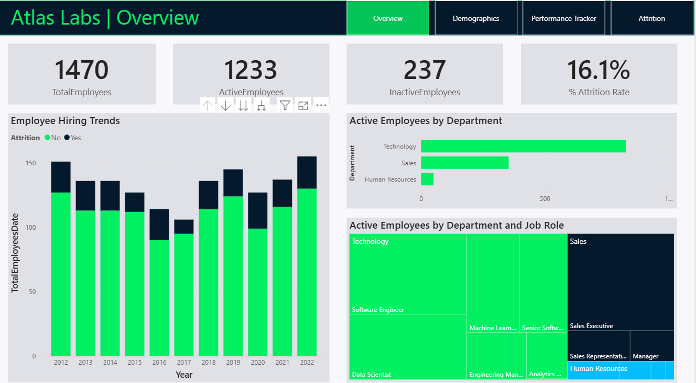
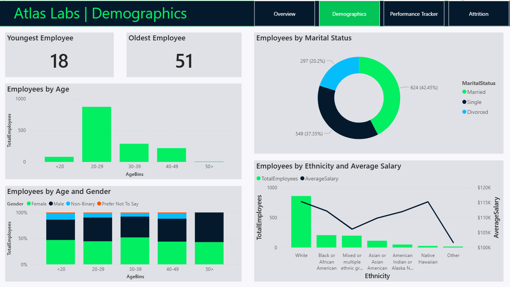
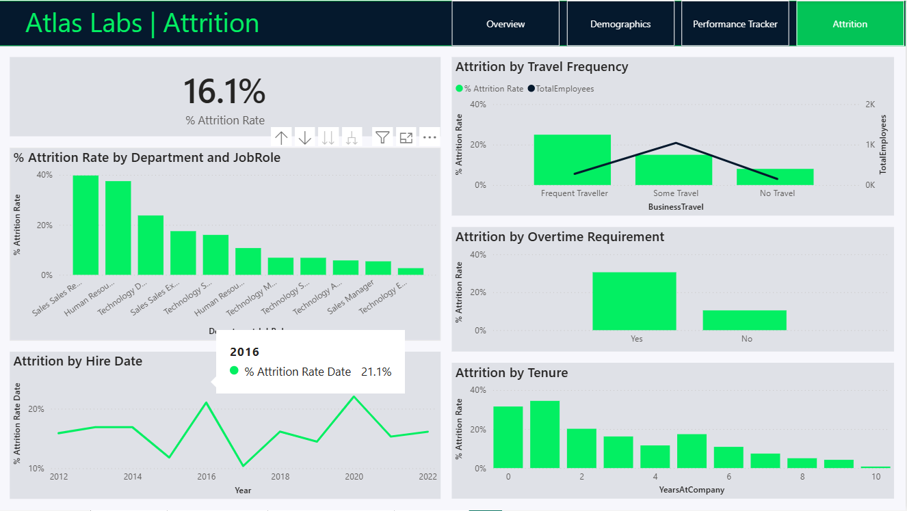

# HR Analytics Dashboard in Power BI

## 📈 Dashboards Preview

### 1. Overview

### 2. Demographics

### 3. Performance Tracker

### 4. Attrition

## 📌 Project Overview
This project is an **HR Analytics Case Study** built using **Power BI**.  
The goal is to analyze employee data and provide actionable insights into:
- Workforce demographics
- Employee performance
- Hiring trends
- Attrition (employee turnover)

The project leverages different data dimensions (Employee, Education, Performance, Rating, Satisfaction) and fact tables to design a **comprehensive HR dashboard**.

---

## 📊 Data Description
The dataset contains multiple dimensions and fact tables:

### 1. Employee Table
- **EmployeeID** (unique identifier)
- Demographics: FirstName, LastName, Gender, Age, Ethnicity, State, MaritalStatus
- Work-related: Department, JobRole, BusinessTravel, DistanceFromHome, Overtime, Salary, StockOptionLevel
- Career-related: HireDate, Attrition, YearsAtCompany, YearsInMostRecentRole, YearsSinceLastPromotion, YearsWithCurrManager
- Education: Education, EducationField, EducationLevel

### 2. Performance Table
- **PerformanceID** (unique identifier for review)
- EmployeeID (FK to Employee)
- ReviewDate
- Satisfaction Levels: Environment, Job, Relationship, WorkLifeBalance
- Ratings: SelfRating, ManagerRating
- TrainingOpportunitiesWithinYear / Taken

### 3. Supporting Dimensions
- **DimSatisfiedLevel** → Satisfaction scale (Very Satisfied → Very Dissatisfied)  
- **DimRatingLevel** → Rating scale (Above & Beyond → Unacceptable)  
- **DimEducationLevel** → Education levels (Doctorate, Masters, Bachelors, etc.)  

---

## 📈 Dashboards

### 1. **Overview**
- Total Employees, Active vs Inactive
- Attrition Rate (%)
- Employee Hiring Trends (by year and attrition status)
- Active Employees by Department
- Active Employees by Department & Job Role (TreeMap)

---

### 2. **Demographics**
- Youngest vs Oldest Employee
- Distribution by Age, Gender, Marital Status
- Employees by Ethnicity with Average Salary
- Gender composition by age bins

---

### 3. **Performance Tracker**
- Individual employee performance tracking
- Metrics: Job Satisfaction, Relationship Satisfaction, Environment Satisfaction, Work-Life Balance
- Ratings: Self Rating vs Manager Rating
- Review timeline (Start Date, Last Review, Next Review)

---

### 4. **Attrition**
- Overall Attrition Rate (%)
- Attrition by Department & Job Role
- Attrition by Travel Frequency
- Attrition by Overtime Requirement
- Attrition by Hire Date
- Attrition by Tenure (Years at Company)

---

## ⚙️ Tools & Technologies
- **Power BI** → Data visualization and dashboard creation
- **Data Modeling** → Star schema with Fact and Dimension tables
- **DAX Measures** → Attrition Rate, Active Employees, Average Salary, etc.

---

## 🚀 Key Insights
- Highest attrition observed in **Sales** and **HR** departments.
- Employees required to work **Overtime** have higher attrition rates.
- Majority of employees are aged **20–29 years**.
- Performance satisfaction tends to decrease over time in some cases.
- Early tenure employees (0–2 years) are more likely to leave.

---

## 📂 Project Structure